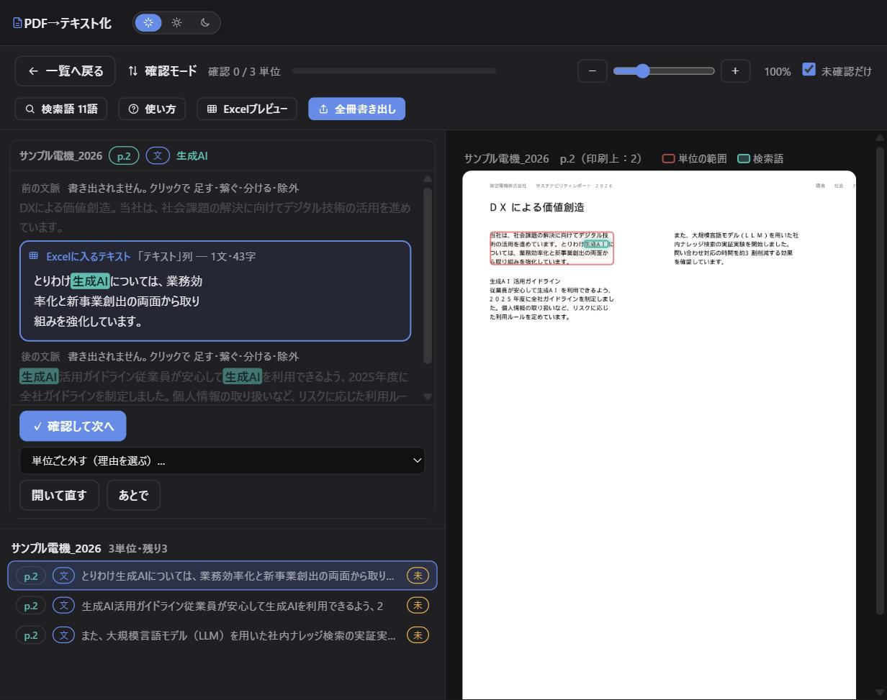
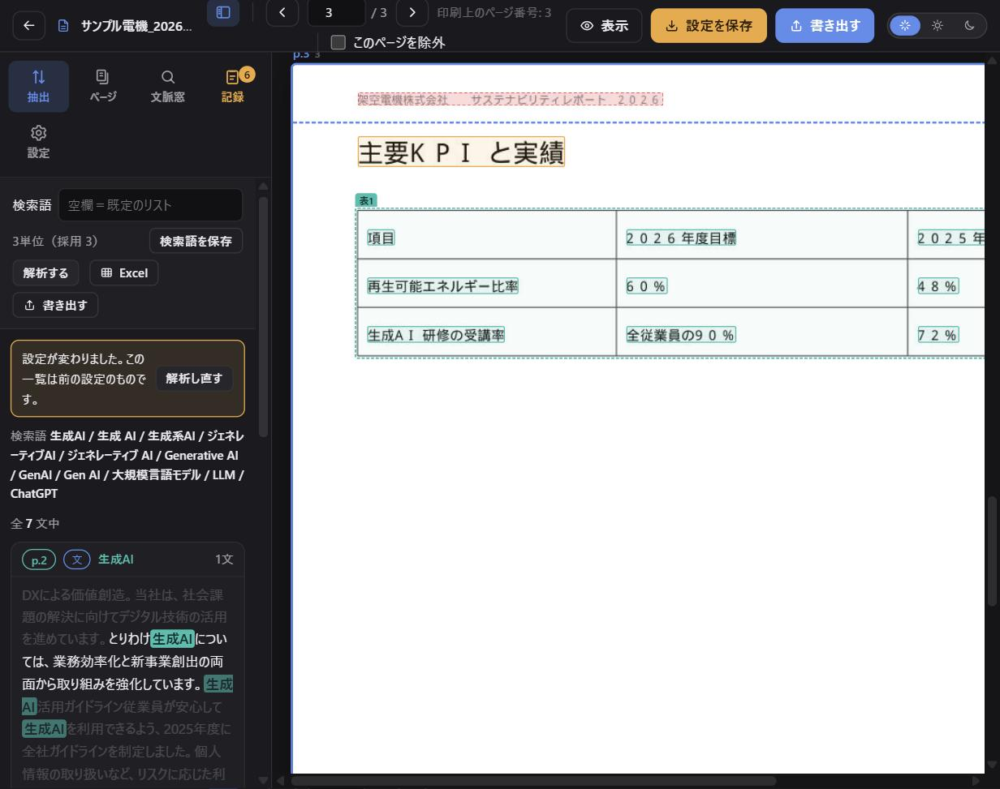
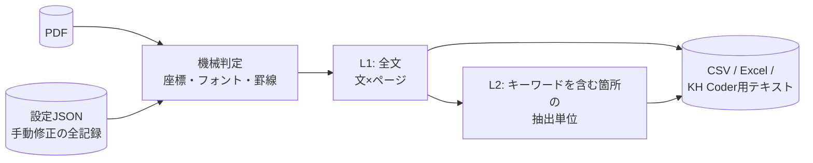

# pdf-text-workbench

**PDF文書を、再現可能・監査可能な形でテキスト化するためのローカルWebワークベンチ。**

企業の報告書のような多段組・図表混じりのPDFからテキストを取り出すとき、
機械抽出だけでは読み順や文の境界が必ずどこかで壊れる。
このツールは、機械判定の結果を**原本と見比べながら人が直し、その判断をすべて記録する**ことで、
「同じPDFと同じ設定ファイルからは、誰がやっても同じテキストになる」状態を作る。
テキストマイニング（KH Coder 等）の前処理として設計している。


## 主な機能

- **レイアウト解析** — 多段組の読み順復元、柱（全ページで反復する文言）の除去、罫線表の「1行=1ブロック」再構成、
  フォントサイズによる種別付け（本文/見出し/注記）。**破壊的な前処理はこの柱除去だけ**
  （座標によるヘッダー/フッターの切り取りとページ除外は廃止 → [ADR-0009](docs/adr/0009-no-margin-cut.md)）
- **確認モード** — キーワードを含む箇所を1件ずつキューで目視確認。検索語の出現位置が原本上でピンポイントに光る。
  修正（文を足す・繋ぐ・分ける・除外）はその場で完結。確認の取り消し（未確認に戻す）もできる
- **すべての操作を記録** — 手動の修正は理由コードつきで文書ごとの設定JSONに保存。
  除外した箇所も消さずに監査記録として出力（→ [ADR-0002](docs/adr/0002-settings-json.md)）
- **出現率** — 文書ごとの総文数・ヒット文数・ページ数と出現率を一覧・CSV出力。
  分子・分母とも機械判定（L1）で、手動修正の影響を受けない
- **出力** — CSV（全件=監査記録）/ Excel（外部変数つき）/ KH Coder用テキスト
- **キャッシュとジョブ** — 数十冊規模でも実用速度（メモリ＋ディスクの2段キャッシュ・並列事前解析・進捗つき非同期処理）

## スクリーンショット

確認モード：左のカードが抽出単位（青枠=出力される範囲）、右の原本では検索語そのものがハイライトされる。



作業画面：罫線表は行単位のブロックに再構成される。赤い破線=柱として捨てられる反復行。



## クイックスタート

```bash
git clone https://github.com/1f10230039/pdf-text-workbench.git
cd pdf-text-workbench
pip install -r requirements.txt

python examples/make_sample.py   # 動作確認用のサンプルPDFを生成
python ui/app.py                 # → http://127.0.0.1:5000 が開く
```

画面から `examples/sample.pdf` をアップロードすれば、2段組・見出し・罫線表を含む
サンプル文書で一通りの機能を試せる。詳細は [セットアップ手順](docs/runbooks/setup.md)。

## 仕組み（概要）



- 抽出ロジックは `core.py` に集約し、Web UIとバッチ（`pdf2txt.py`）が同じ関数を呼ぶ
- 出現率の集計（L1）と内容分析用の単位化（L2）を分離し、手作業が統計量を歪めない構造にしている
- LLMは使わない。決定性と説明可能性を優先した（→ [ADR-0003](docs/adr/0003-no-llm.md)）

詳細は [アーキテクチャ概要](docs/architecture.md) を参照。

## ディレクトリ構成

```
├── core.py            # 抽出エンジン（画面もI/Oも持たない純粋層）
├── cachekit.py        # キャッシュの署名・永続化（UIとバッチで共通）
├── pdf2txt.py         # 一括変換バッチ
├── warm_cache.py      # キャッシュの並列事前生成
├── ui/
│   ├── app.py         # Flask サーバー（REST API・ジョブ）
│   └── static/        # フロントエンド（vanilla JS）
├── examples/          # サンプルPDFのジェネレータ
├── tests/             # ユニットテスト
└── docs/
    ├── architecture.md
    ├── data-model.md
    ├── adr/           # アーキテクチャ決定記録
    └── runbooks/      # セットアップ・運用・デプロイ手順
```

## ドキュメント

| ドキュメント | 内容 |
|---|---|
| [アーキテクチャ概要](docs/architecture.md) | 全体構成・抽出パイプライン・キャッシュ・並行処理 |
| [データモデル](docs/data-model.md) | 設定JSONのスキーマ・出力ファイル・キャッシュ構造 |
| [ADR 一覧](docs/adr/README.md) | 主要な設計判断の記録（9件） |
| [セットアップ手順](docs/runbooks/setup.md) | 初回セットアップ・データディレクトリ |
| [運用手順](docs/runbooks/operations.md) | 推奨フロー・キャッシュ・トラブルシューティング |
| [デプロイ手順](docs/runbooks/deploy.md) | 公開デモ（Render）のデプロイとロールバック |

## 開発

```bash
pip install ruff pytest
ruff check .    # 静的解析
pytest -q       # ユニットテスト
```

CI（GitHub Actions）で lint・テスト・サンプルPDFのエンドツーエンド抽出を検証している。

## ライセンス

[MIT](LICENSE)
