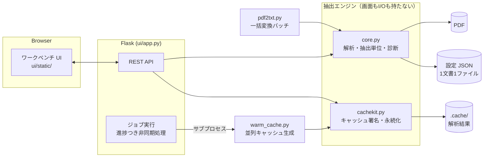
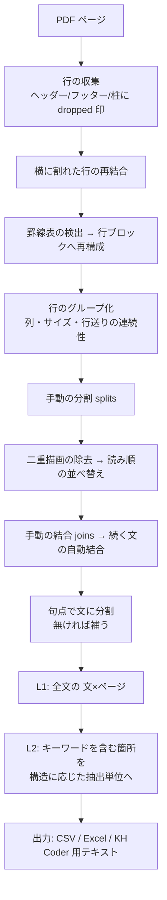

# アーキテクチャ概要

## 全体構成

ローカルで完結する Flask アプリケーション。抽出ロジックはすべて `core.py` に集約し、
Web UI（`ui/`）とバッチ（`pdf2txt.py`）が同じ関数を呼ぶ。
**UI で確認した結果とバッチの出力が食い違わないこと**を構成レベルで保証している。

### 設計原則

1. **core は純粋層** — `core.py` には画面もファイル I/O も置かない。「PDF と設定を渡すと
   抽出結果が返る」だけにする。UI とバッチの結果が一致することの根拠。
2. **すべての手動操作を設定 JSON に記録する** — 除外・結合・分割・表の指定・種別の修正など、
   人が加えた判断は理由コードつきで文書ごとの JSON に残る。同じ PDF と同じ JSON からは
   常に同じ出力が得られる（[ADR-0002](adr/0002-settings-json.md)）。
3. **機械判定は破壊しない** — ヘッダー・フッター・柱の除去は「捨てる」のではなく
   `dropped` 印を付けて保持する。UI が「何が切り落とされているか」を可視化でき、
   境界診断（`boundary_scan`）の材料にもなる。

## 抽出パイプライン

- **L1（全文層）**：文書全体を「文 × ページ」の行にする。出現率などの分母・分子はここで数える。
- **L2（抽出層）**：検索語を含む箇所だけを、構造に応じた単位（本文の文／表の行／図解のラベル／見出し）に
  まとめる。内容分析（共起・KWIC）はここを使う（[ADR-0006](adr/0006-two-layers.md)）。

## キャッシュ

解析は 1 文書あたり数秒〜数十秒かかるため、2 段のキャッシュを持つ。

| 段 | 置き場 | 内容 | 無効化の条件 |
|---|---|---|---|
| メモリ | プロセス内 | 直近の解析行・ページ画像・表検出結果 | PDF の更新／関係する設定の変更 |
| ディスク | `.cache/` | 全文書の解析行（設定の署名つき） | PDF の更新／署名に含まれる設定の変更 |

ディスクキャッシュは `warm_cache.py` で**事前に温められる**（未解析文書だけを
サブプロセス並列で解析する）。UI は時間のかかる操作の前にこれをジョブとして呼び、
初回アクセスの待ち時間を減らしている。

キャッシュの鍵は **設定の署名**（結果に影響する設定だけを正規化して JSON 化したもの）。
署名の生成は `cachekit.py` に一本化し、UI とバッチが必ず同じ鍵を使う。

## 並行処理

- 時間のかかる処理（全文書の解析・一括書き出し）は**ジョブ**として別スレッドで実行し、
  UI は進捗（％・処理中の文書名）をポーリングする。
- PyMuPDF はスレッドセーフではないため、PDF に触るすべての区間をグローバルな
  再入可能ロックで直列化している（[ADR-0007](adr/0007-pymupdf-lock.md)）。

## デプロイ形態

| 形態 | 用途 | データ |
|---|---|---|
| ローカル（既定） | 本番の抽出作業 | `WORKBENCH_DATA` のディレクトリに永続化 |
| 公開デモ（`PUBLIC_MODE=1`） | 第三者による手順の再現 | プロセスごとの一時ディレクトリ（再起動で消える） |

公開デモは Render の Blueprint（`render.yaml`）でデプロイする。→ [デプロイ手順](runbooks/deploy.md)
