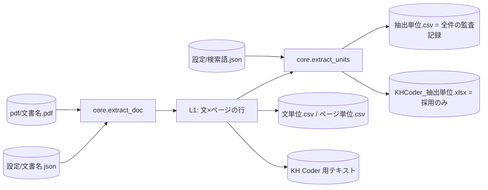

# データモデル

このアプリは RDB を使わない。**「PDF ＋ 設定 JSON → 決定的に同じ出力」**という関数型の
データフローが中心で、状態はすべてファイルに置く。

## 設定 JSON（1 文書 1 ファイル）

抽出に影響するすべてのパラメータと、人が加えたすべての判断を持つ。
**このファイルが再現性の実体**であり、成果物と一緒に保管する前提で設計している。

### パラメータ（機械判定の閾値）

| キー | 既定 | 意味 |
|---|---|---|
| `body_size` | 自動推定 | 本文のフォントサイズ。種別（本文／大／小／極小）判定の基準 |
| `repeat_ratio` | 0.3 | 全ページの一定割合以上で同位置・同文言の行を「柱」として除去。**唯一の破壊的前処理**（[ADR-0009](adr/0009-no-margin-cut.md)） |
| `col_tol` / `line_gap` / `join_gap` | 12 / 2.2 / 1.2 | 行のグループ化（段組・行送り・横割れ）の許容量 |
| `table_strategy` | `lines_strict` | 罫線による表検出の方式 |
| `min_len` | 2 | これ未満の断片を捨てる最小文字数 |

### 手動操作の記録（すべて理由コードつき）

| キー | 単位 | 意味 |
|---|---|---|
| `excluded` | 文 | ロゴ・参照表記など、文書の記述でないものの除外 |
| `joins` / `splits` | ブロック | 機械が切りすぎた箇所の結合／癒着した箇所の分割（互いに逆操作） |
| `kinds` | ブロック | フォントサイズからの種別自動判定の上書き |
| `manual_order` | ページ | 読み順の手動指定 |
| `tables` / `table_off` | 範囲／ページ | 表の手動指定／表の自動検出の停止 |
| `unit_merges` / `unit_excludes` | 抽出単位 | 抽出単位への文の追加／単位の除外（L2 層。理由コードに 目次/表紙/章扉/対照表/ヘッダー/フッター を含む） |
| `unit_checks` | 抽出単位 | 目視確認の記録（確認日時と所要秒数）。取り消すと記録ごと消える |

`header_y` / `footer_margin` / `skip_pages` / `task_states` / `boundary_check` は
座標カット・ページ除外の廃止（[ADR-0009](adr/0009-no-margin-cut.md)）に伴い引退した。
古い設定 JSON に残っていても読み込み時に無視される。

照合の鍵はテキストの完全一致（＋必要に応じてページ・座標）。パラメータ変更などで
**当たらなくなったルールは黙って無視せず、UI に警告として表示**する。

## 検索語（全文書共通）

`設定/検索語.json`。抽出単位の対象を決めるキーワードのリスト。
文書ごとに変えると比較が壊れるため、意図的にグローバルへ置いている。
英字語は単語境界を検証してから照合する（部分一致の誤ヒットを防ぐ）。

## 出力ファイル

| ファイル | 内容 |
|---|---|
| `文単位_文書名.csv` | L1 の全文（ページ・セクション・種別・文） |
| `ページ単位_文書名.csv` | L1 をページ単位に集約したもの |
| `抽出単位.csv` | L2 の**全件**（除外した単位も理由つきで含む＝監査記録） |
| `KHCoder_抽出単位.xlsx` | L2 の採用分のみ。外部変数（文書名・年・ページ等）つき |
| `txt/文書名.txt` | KH Coder 用テキスト（`<h1>`=文書、`<h2>`=ページ、1 行 1 文） |

## キャッシュディレクトリ（`.cache/`）

| ファイル | 内容 |
|---|---|
| `文書名.rows.json` | L1 の解析行（設定署名・PDF 更新時刻つき） |
| `文書名.cands.json` | 本文サイズの推定値 |
| `文書名.meta.json` | 一覧表示用のメタ（単位数・確認数など） |

キャッシュはすべて再生成可能で、削除しても結果は変わらない（時間がかかるだけ）。
